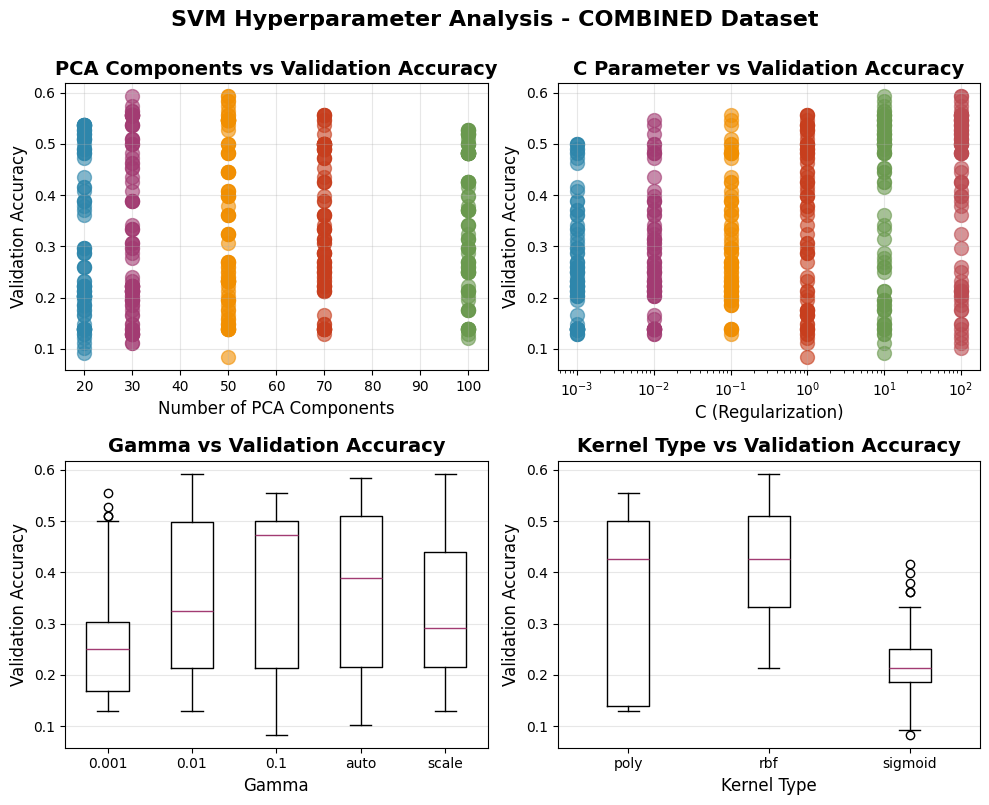
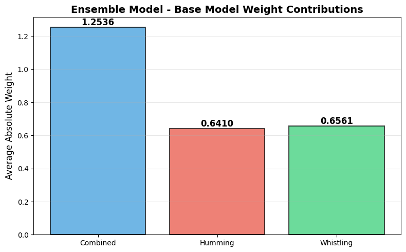
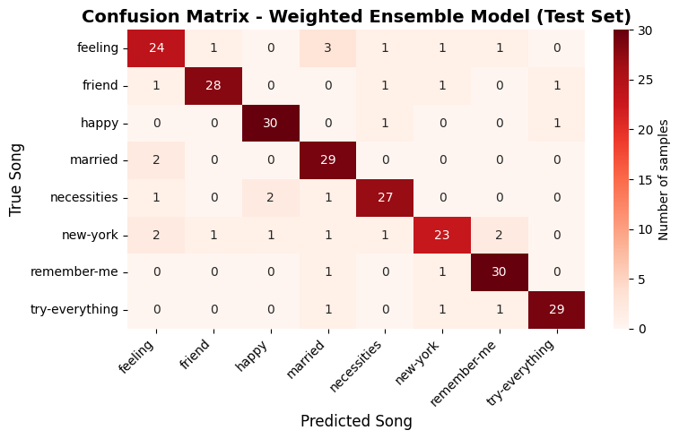

# ECS7020P Principles of Machine Learning - Mini Project

This repository contains the mini project for the ECS7020P Principles of Machine Learning course at Queen Mary University of London.

## Project Overview

This project develops an automated song recognition system capable of identifying songs from human vocal interpretations (humming and whistling).
The system addresses a challenging multi-class classification problem where conventional audio features like lyrics and instrumentation are absent, requiring the extraction of melodic and acoustic patterns from vocal performances.

### Key Features

- **Multi-Dataset Architecture**: Implements three separate datasets (combined, humming-only, whistling-only) enabling specialised model training for different interpretation types
- **Comprehensive Audio Processing Pipeline**:
  - Preprocessing optimisation (noise reduction, volume normalisation, silence trimming, sampling rate standardisation)
  - Advanced feature extraction (250-dimensional vectors including MFCCs, chroma features, spectral contrast, pitch contours)
- **Support Vector Machine Classification**: Optimised SVM classifiers with hyperparameter tuning via grid search (PCA dimensionality, kernel type, regularisation parameter C, kernel coefficient γ)
- **Weighted Ensemble Learning**: Meta-learning approach using Logistic Regression to combine predictions from all three base models, learning optimal weights to leverage complementary model strengths
- **Rigorous Evaluation**: Comprehensive performance analysis using accuracy metrics, per-class precision/recall/F1-scores, confusion matrices, and ensemble weight analysis

### Problem Statement

Given a 10-second audio recording of a person humming or whistling a melody, identify which of eight songs is being performed. The challenge arises from:

- Variability in human vocal interpretations (pitch, tempo, accuracy)
- Absence of lyrics and instrumental features
- Environmental noise and variable recording quality

### Methodology

The system employs a three-stage supervised learning framework:

1. **Preprocessing Optimisation**: Grid search over preprocessing parameters using 5% of training data with lightweight SVM for rapid evaluation
2. **SVM Hyperparameter Optimisation**: Independent grid searches for each dataset configuration (combined, humming, whistling) to find optimal PCA dimensions, kernel types, and regularisation parameters
3. **Ensemble Meta-Learning**: Logistic Regression meta-classifier learns optimal combination weights from probability predictions of all three base models

### Dataset

The [MLEnd Hums and Whistles II](https://github.com/thekmannn/MLEndHW_Sample) dataset comprises 800 audio recordings of eight songs performed by multiple participants:

- Songs: "Feeling", "Friend", "Happy", "Married", "Necessities", "New York", "Remember Me", "Try Everything"
- Interpretation types: Humming and whistling
- Dataset split: 70% training, 21% test, 9% validation (stratified)

### Results

The implemented system achieves test accuracy substantially above random chance (12.5% for 8-class classification), demonstrating successful learning of melodic and acoustic patterns from human vocal interpretations. The weighted ensemble approach often outperforms individual base models by learning optimal combination strategies.

#### SVM Hyperparameter Optimisation

The grid search across PCA components, kernel types, regularisation parameters (C), and kernel coefficients (γ) reveals optimal configurations for each dataset:

_Figure 1: Hyperparameter analysis for the combined dataset showing the relationship between PCA components, C parameter, gamma values, and kernel types with validation accuracy._

#### Ensemble Model Performance

The weighted ensemble meta-classifier learns optimal combination weights from the three base models:

_Figure 2: Average absolute weight contributions of each base model (Combined, Humming, Whistling) to the ensemble predictions._

#### Confusion Matrix

The confusion matrix reveals which songs are most frequently confused:

_Figure 3: Confusion matrix for the weighted ensemble model on the test set, showing prediction patterns across all eight songs._

## Requirements

Python 3.13.3 is used for this project. All dependencies are listed in `requirements.txt`.

## Files

- `ecs7020_miniproject_2526.ipynb`: Main Jupyter notebook containing complete implementation and analysis
- `requirements.txt`: Python package dependencies
- `runtime.txt`: Python runtime specification for Binder
- `dataset/`: Directory for storing downloaded audio samples

## Author

Philipp Schmidt

## Acknowledgements

- Dataset: [MLEnd Hums and Whistles II](https://github.com/thekmannn/MLEndHW_Sample)
